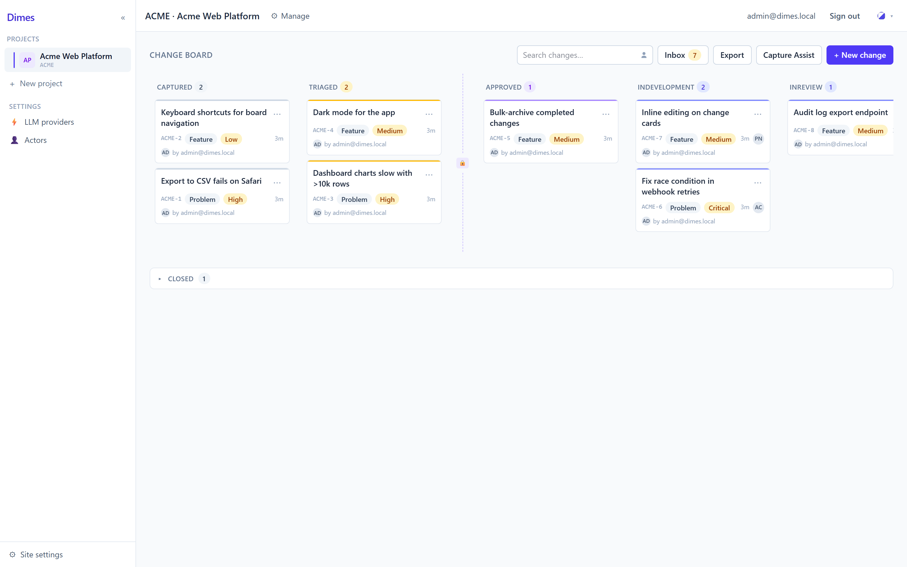
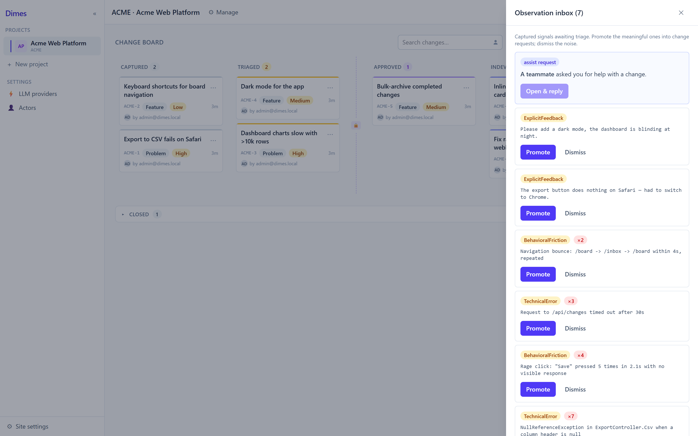
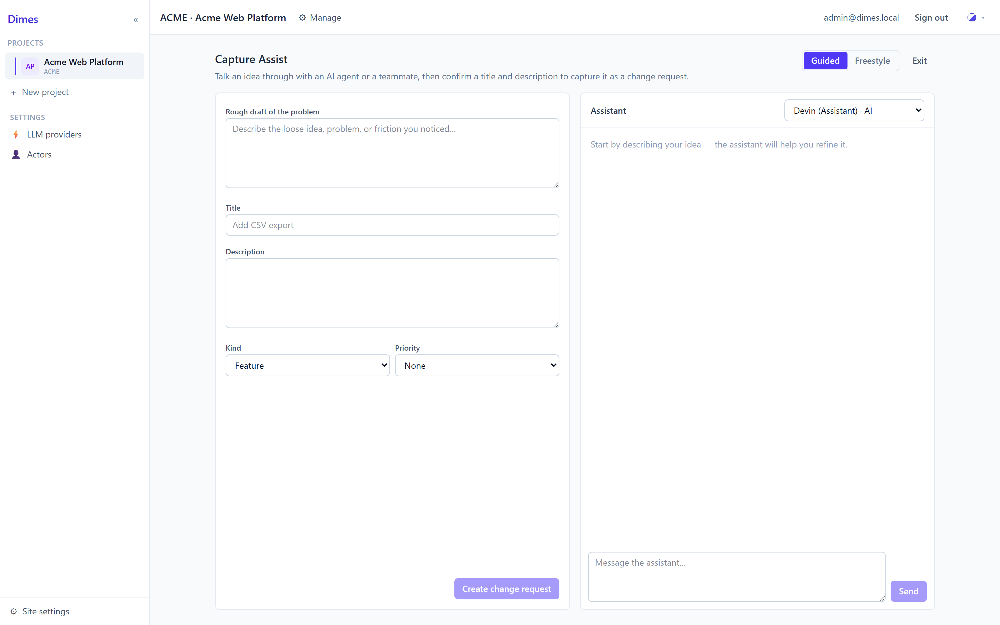
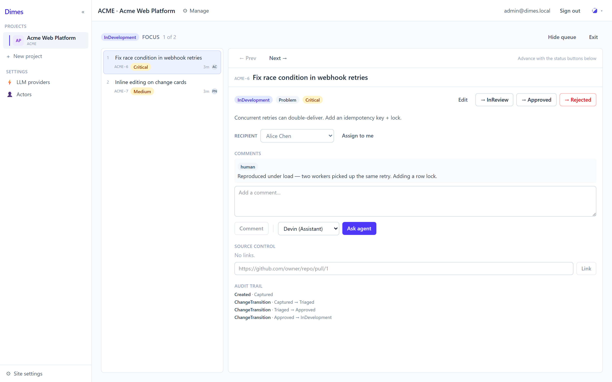

# Dimes

**A self-hosted software change tracker that turns signals into governed change.**

<!-- TODO: add badges once CI / release are public, e.g. License · .NET 10 · build status -->

Dimes is a self-hosted, single-tenant change tracker. Problems, feature requests, and **latent
observations** (signals captured from inside your own apps) flow into a curated inbox, get promoted
into **Change Requests**, and move through a fixed lifecycle gated by a **Maintainer approval step**. It
deliberately *"consumes meaningful/recurring signals into a curated change list; it does not mirror the
log firehose"* or try to be an error tracker. AI participates as a first-class actor. Every status change,
whether by a person or an agent, passes through a single server-side lifecycle engine with role-based
guards, and an append-only audit trail names whoever made the move. Today the Assistant role holds no
transition rights, so AI is recommend-only: it comments, but only people move work through the lifecycle.

## Why Dimes

Useful signals scatter: an error in the logs, a frustrated click in the UI, a feature ask in chat, a bug
report in email. They mix high-value insight with noise, and none of them are connected to a decision or a
visible plan. Dimes gives you **one curated pipeline**: capture the signal, decide whether it matters,
gate approval tightly, and move the resulting change through a lifecycle everyone can see, all running on
infrastructure you control. It's built for engineering teams that want to self-host and keep their
observational data in their own environment.

## Screenshots

| Change board | Observation inbox |
| --- | --- |
|  |  |
| **Capture Assist** | **Focus Mode** |
|  |  |

## Capabilities

**Capture Assist** is an AI-assisted path from a vague problem to well-formed change requests. In
**guided mode**, you work the problem out in conversation with an agent assigned to the project, talking
through what's actually wrong and querying it as you go, and the agent helps turn that into one or more
proposed change requests. In **freestyle mode**, you hand it loose markdown (notes, a brain-dump, a
meeting's worth of asks) and the agent decomposes it into a suggested list. Both paths end the same way:
the agent proposes, you edit, and you approve what lands on the board. Nothing is created without your
sign-off. Like everything else in Dimes, it runs on your own LLM, whether Anthropic or any
OpenAI-compatible endpoint, so the problem you're working through never leaves infrastructure you control.

- **Capture:** an explicit feedback widget; the [`@dimes/sdk`](#embedding-the-capture-sdk) for latent
  client signals (uncaught errors, rage clicks, navigation breadcrumbs); a Seq integration for server-side
  exceptions; **Capture Assist** (described above); plus a Simulate Capture harness for testing.
- **Observation inbox:** triage incoming signals (`New → Clustered`), **Promote** an observation into a
  new Change Request with the signal attached as evidence, or **Dismiss** it. Repeated signals aggregate by
  fingerprint with an occurrence count.
- **Change board:** a Kanban view across the lifecycle
  (`Captured → Triaged → Approved → InDevelopment → InReview → Done`, plus `Rejected` / `Duplicate`).
  Drag a card to transition it (illegal or unauthorized moves are rejected), with live search and an
  "assigned to me" filter.
- **Change detail:** edit metadata and priority, assign work, discuss in a comment thread (including
  recommend-only agent comments), link GitHub PRs/commits with a read-only context snapshot, and read an
  append-only **audit trail** of every transition.
- **Focus Mode:** a low-chrome, single-state work queue for developers clearing `InDevelopment` or
  reviewers validating `InReview`.
- **Roles & identity:** per-project roles (Reporter, Contributor, Maintainer; plus Assistant for agents).
  Guards are enforced per role; the most important is the **Maintainer gate** on **`Triaged → Approved`**
  and on acceptance (`→ Done`). Authentication is built in: **Local** (email + password) or
  **OIDC / Keycloak**.
- **AI providers:** bring your own LLM, whether Anthropic (primary) or any OpenAI-compatible endpoint,
  including local runners like Ollama / vLLM. Commentary is recommend-only, and API keys are referenced
  from a secret store, never stored in plaintext.

## Quick start

**Prerequisites:** [.NET 10 SDK](https://dotnet.microsoft.com/) and Node.js 20+.

The API uses SQLite by default and applies its migrations automatically on startup, so a fresh checkout
needs no manual database step.

```bash
# 1. Run the API (from the repo root). Port 5080 is what the web dev proxy expects.
dotnet run --project src/Dimes.Api --urls http://localhost:5080

# 2. In a second terminal, run the web app.
cd web
npm install
npm run dev        # Vite dev server on http://localhost:5173 (proxies /api → :5080)
```

Open <http://localhost:5173> and sign in with the seeded development admin:

```
Email:    admin@dimes.local
Password: dimes-dev
```

> Run the API **first**; the web app has no mock backend. These dev credentials come from
> `src/Dimes.Api/appsettings.Development.json`; **change them for any real deployment** (see
> [Security](#security)).

## Embedding the capture SDK

The `@dimes/sdk` is a framework-agnostic, dependency-light TypeScript library you embed in a host app to
capture latent and explicit signals. First create an **Observation Source** in the project's settings to
get a `sourceId`, then:

```ts
import { init, mountFeedbackWidget } from '@dimes/sdk'

const client = init({
  endpoint: 'https://dimes.example.com', // your Dimes API origin
  sourceId: '<observation-source-id>',   // created in project settings
  appVersion: '1.2.3',
})

// Passive capture (uncaught errors + rage clicks + navigation breadcrumbs) is on by default.
// Send explicit user feedback any time:
client.captureFeedback('The export button does nothing on Safari')

// Optionally mount a floating "Feedback" button:
const unmount = mountFeedbackWidget(client, { label: 'Send feedback' })
```

A `beforeSend` hook lets you redact or drop events, and `sampleRate` throttles passive signals (explicit
feedback always sends). See [`sdk/src`](sdk/src) for the full surface.

## Architecture

Dimes is three independently-built pieces:

- **`src/`, the .NET 10 API.** Layered as `Dimes.Domain` (entities + the load-bearing `LifecycleService`
  that is the single authority for every status change), `Dimes.Infrastructure` (EF Core, migrations,
  provider implementations), and `Dimes.Api` (controllers, services, DTOs).
- **`web/`, the React 19 SPA.** Vite, Tailwind CSS v4, TanStack Query, and dnd-kit for the board.
- **`sdk/`, the TypeScript capture SDK** (`@dimes/sdk`), built with tsup to CJS + ESM + types.

```bash
# Backend (from repo root)
dotnet build Dimes.slnx
dotnet test

# Web (from web/)
npm install && npm run build      # tsc -b && vite build
npm run lint

# SDK (from sdk/)
npm install && npm run build && npm test
```

The data model targets both SQLite (the tested default) and Postgres, each with its own EF Core migration
set. [`CLAUDE.md`](CLAUDE.md) documents the conventions, the migration workflow, and the architecture in
depth; [`specs/spec.md`](specs/spec.md) is the authoritative design doc.

## Deployment

Dimes runs behind a **single public origin**: a reverse proxy serves the built SPA as static files and
forwards the API-owned paths (`/api`, `/hubs`, `/signin-oidc`, `/health`) to the .NET app. Keeping
everything same-origin is what lets the BFF session cookie and the OIDC redirect flow work. When the API
sits behind a TLS-terminating proxy, set `Proxy__UseForwardedHeaders=true` so it builds correct `https`
redirect URIs (enable this **only** when the API is reachable exclusively through the proxy).

SQLite is fine for small installs; point `ConnectionStrings__Dimes` at Postgres for heavier ones.

Ready-made references:

- [`deploy/`](deploy): sample **nginx** and **Caddy** configs (see [`deploy/README.md`](deploy/README.md)).
- [`.do/app.yaml`](.do/app.yaml): a **DigitalOcean App Platform** spec (its ingress is the proxy).
- [`Dockerfile`](Dockerfile): a multi-stage image for the API (the SPA deploys separately as static files).

## Security

- **Governed transitions.** All state changes go through a single server-side lifecycle engine with role
  guards, and an append-only audit trail records who made each transition. Agents are actors inside that
  same model; today the Assistant role carries no transition permissions, so in practice AI is
  recommend-only. Because authorization is enforced centrally rather than by which buttons are shown, the
  guard holds the same no matter who or what is acting.
- **Authentication** is required on every endpoint by default. Choose **Local** (email + password, with a
  bootstrap site admin) or **OIDC / Keycloak** (server-side authorization-code flow with an HttpOnly
  session cookie, so no tokens reach the browser).
- **Secrets** (LLM API keys, the OIDC client secret) are *referenced* and resolved at runtime from
  environment variables or a secret store, never committed to the repo or stored in the database in
  plaintext.

**Reporting a vulnerability:** please report security issues privately through
[GitHub's private vulnerability reporting](https://github.com/ahaley/Dimes/security/advisories/new) rather
than opening a public issue.

## Project status & scope

Dimes is an early, self-hosted, single-tenant project. Recommend-only is the current default for AI rather
than a fixed limit: the Assistant role simply holds no transition permissions today. Several larger
capabilities are deliberately **not built yet** (tracked in [`specs/parking-lot.md`](specs/parking-lot.md)):

- code-executing agents (opening branches/PRs) and autonomous AI approval
- per-change preview/deploy environments and CI/CD propagation
- richer capture (session replay, screenshots) and automatic ML clustering
- more LLM providers (e.g. Gemini) and SCM providers (GitLab, Azure DevOps)
- configurable per-project workflows, and multi-tenant / hosted offerings

## Contributing

Contributions are welcome. Start with [`CLAUDE.md`](CLAUDE.md) for build/test commands, project
conventions, and the migration workflow, and treat [`specs/spec.md`](specs/spec.md) as the design
authority for architectural decisions.

## License

[MIT](LICENSE) © 2026 Antonio Haley
