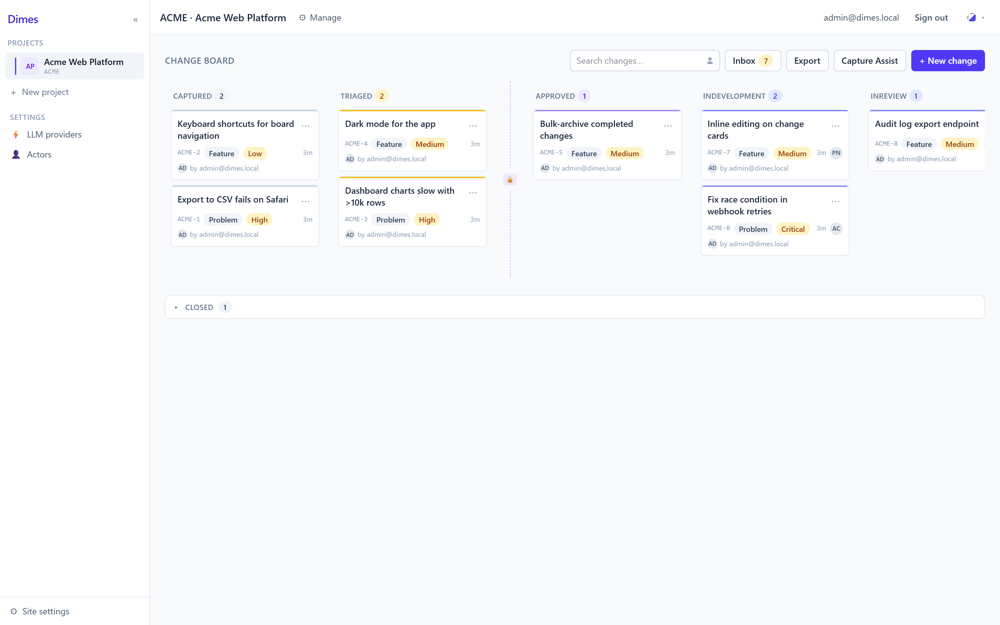
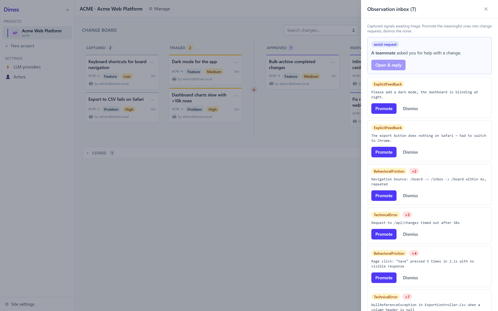
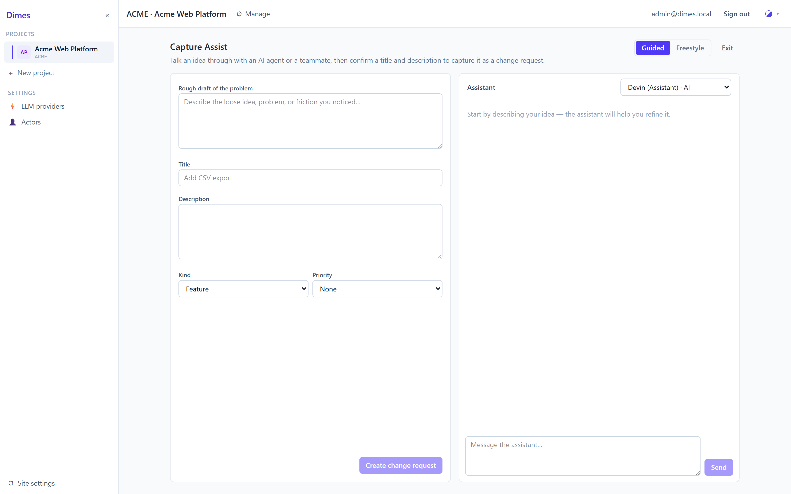
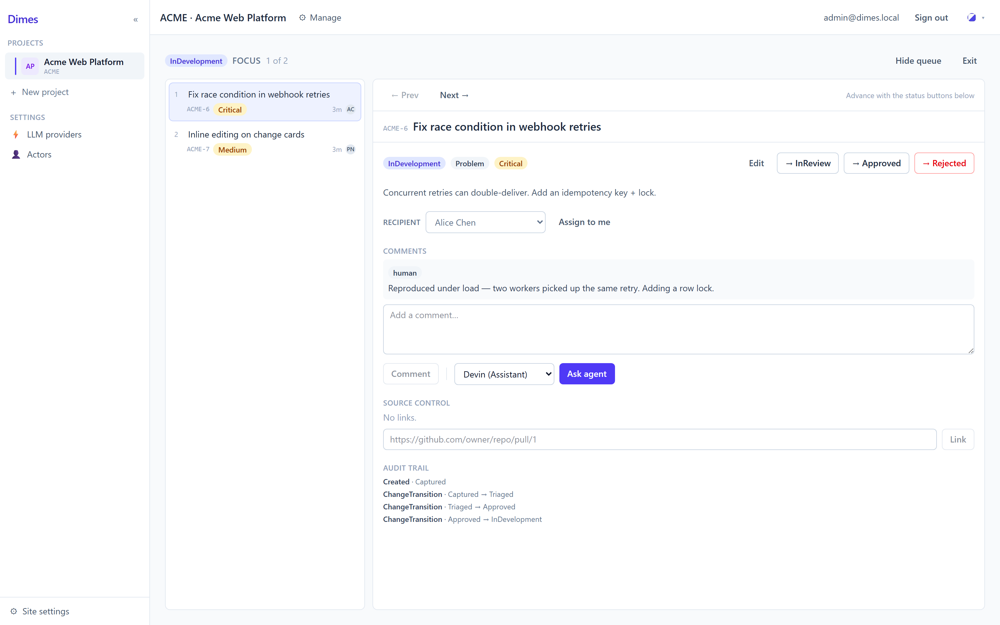

# Dimes

**A self-hosted software change tracker that turns signals into governed change.**

<!-- TODO: add badges once CI / release are public, e.g. License · .NET 10 · build status -->

Dimes is a self-hosted, single-tenant change tracker. Problems, feature requests, and **latent
observations** (signals captured from inside your own apps) flow into a curated inbox, get promoted
into **Change Requests**, and move through a fixed lifecycle gated by a **Maintainer approval step**. It
deliberately *"consumes meaningful/recurring signals into a curated change list; it does not mirror the
log firehose"* or try to be an error tracker. AI participates as a first-class actor. Every status change,
whether by a person or an agent, passes through a single server-side lifecycle engine with role-based
guards, and an append-only audit trail names whoever made the move. Today the Assistant role holds no
transition rights, so AI is recommend-only: it comments, but only people move work through the lifecycle.

## Why Dimes

Useful signals scatter: an error in the logs, a frustrated click in the UI, a feature ask in chat, a bug
report in email. They mix high-value insight with noise, and none of them are connected to a decision or a
visible plan. Dimes gives you **one curated pipeline**: capture the signal, decide whether it matters,
gate approval tightly, and move the resulting change through a lifecycle everyone can see, all running on
infrastructure you control. It's built for engineering teams that want to self-host and keep their
observational data in their own environment.

## Screenshots

| Change board | Observation inbox |
| --- | --- |
|  |  |
| **Capture Assist** | **Focus Mode** |
|  |  |

## Capabilities

**Capture Assist** is an AI-assisted path from a vague problem to well-formed change requests. In
**guided mode**, you work the problem out in conversation with an agent assigned to the project, talking
through what's actually wrong and querying it as you go, and the agent helps turn that into one or more
proposed change requests. In **freestyle mode**, you hand it loose markdown (notes, a brain-dump, a
meeting's worth of asks) and the agent decomposes it into a suggested list. Both paths end the same way:
the agent proposes, you edit, and you approve what lands on the board. Nothing is created without your
sign-off. Like everything else in Dimes, it runs on your own LLM — Anthropic, Gemini, or any
OpenAI-compatible endpoint — so the problem you're working through never leaves infrastructure you control.

- **Capture:** an explicit feedback widget; the [`dimes-capture-sdk`](#embedding-the-capture-sdk) for latent
  client signals (uncaught errors, rage clicks, navigation breadcrumbs); a Seq integration for server-side
  exceptions; **Capture Assist** (described above); plus a Simulate Capture harness for testing.
- **Observation inbox:** triage incoming signals (`New → Clustered`), **Promote** an observation into a
  new Change Request with the signal attached as evidence, or **Dismiss** it. Repeated signals aggregate by
  fingerprint with an occurrence count.
- **Change board:** a Kanban view across the lifecycle
  (`Captured → Triaged → Approved → InDevelopment → InReview → Done`, plus `Rejected` / `Duplicate`).
  Drag a card to transition it (illegal or unauthorized moves are rejected), with live search and an
  "assigned to me" filter.
- **Change detail:** edit metadata and priority, assign work, discuss in a comment thread (including
  recommend-only agent comments), link GitHub PRs/commits with a read-only context snapshot, and read an
  append-only **audit trail** of every transition.
- **Focus Mode:** a low-chrome, single-state work queue for developers clearing `InDevelopment` or
  reviewers validating `InReview`.
- **Roles & identity:** per-project roles (Reporter, Contributor, Maintainer; plus Assistant for agents).
  Guards are enforced per role; the most important is the **Maintainer gate** on **`Triaged → Approved`**
  and on acceptance (`→ Done`). Authentication is built in: **Local** (email + password) or
  **OIDC / Keycloak**.
- **AI providers:** bring your own LLM — Anthropic (primary), Gemini (Google AI or Vertex AI), or any
  OpenAI-compatible endpoint, including local runners like Ollama / vLLM. Model ids are never hardcoded,
  and an endpoint that lists its models can be probed from the form. Commentary is recommend-only, and
  credentials are referenced from a secret store, never stored in plaintext. See
  [Adding an LLM provider](#adding-an-llm-provider).

## Quick start

**Prerequisites:** the [.NET 10 SDK](https://dotnet.microsoft.com/download/dotnet/10.0) and
[Node.js 20+](https://nodejs.org/). Check what you have with `dotnet --version` (expect `10.0.x`) and
`node --version` (expect `v20` or newer). A `global.json` pins the SDK to the .NET 10 band, so an older
SDK fails fast with a clear message instead of a confusing build error.

The API uses SQLite by default and applies its migrations automatically on startup, so a fresh checkout
needs no manual database step.

```bash
# 1. Run the API (from the repo root). The default launch profile binds http://localhost:5080 — the
#    port the web proxy expects — and runs in Development, which seeds the dev admin shown below.
dotnet run --project src/Dimes.Api

# 2. In a second terminal, run the web app. You only need web/ to run Dimes; sdk/ is a separate
#    embeddable library (see below) and isn't required here.
cd web
npm install
npm run dev        # Vite dev server on http://localhost:5173 (proxies /api → :5080)
```

Open <http://localhost:5173> and sign in with the seeded development admin:

```
Email:    admin@dimes.local
Password: dimes-dev
```

> Run the API **first**; the web app has no mock backend. If you open the web app before the API is
> up, you'll see a "Cannot reach the Dimes API" screen that clears itself once the API is running.
> These dev credentials come from `src/Dimes.Api/appsettings.Development.json`; **change them for any
> real deployment** (see [Security](#security)).

<details>
<summary>First-run notes & troubleshooting</summary>

- **"Cannot reach the Dimes API":** the web app loaded but the API isn't responding. Start it with
  `dotnet run --project src/Dimes.Api` from the repo root; the screen recovers on its own.
- **API on a different host/port:** the dev server is pinned to `5173` and proxies the API on `5080`.
  To point it elsewhere, copy `web/.env.example` to `web/.env` and set `DIMES_API`.
- **First build is slow:** the initial `dotnet run` restores NuGet packages and the first `npm install`
  pulls the web dependencies — both need network access and take a minute. Later runs are fast.
- **Version complaints:** `global.json` requires a .NET 10 SDK and `web/package.json` expects Node 20+.
  Install the versions linked above if a build fails citing a version.
- **Adding a migration (contributors):** run `dotnet tool restore` once so the pinned `dotnet-ef` tool
  is available — see [`CLAUDE.md`](CLAUDE.md) for the two-provider (SQLite + Postgres) workflow.

</details>

## Adding an LLM provider

Dimes ships no model ids and stores no keys. A provider config is an endpoint type, a free-text model
id, and a **reference** to a credential that is resolved at runtime — so supporting a newly released
model needs no code change and no redeploy. Wiring one up is three steps: bind the credential, create
the provider, attach it to an agent.

Four endpoint types are supported:

| Type | How it authenticates | Base URL |
| --- | --- | --- |
| **Anthropic (Claude)** | `x-api-key` header | Defaults to `api.anthropic.com`; an override must stay on `anthropic.com`. |
| **Gemini (Google AI)** | `x-goog-api-key` header | Defaults to `generativelanguage.googleapis.com`; an override must stay on `googleapis.com`. |
| **Gemini (Vertex AI)** | OAuth2 bearer minted from a service-account key, or Application Default Credentials | Defaults to the regional Vertex host for the location you set. |
| **OpenAI-compatible** | `Authorization: Bearer` | Required for anything but OpenAI itself. Permissive on purpose — `localhost` and private-LAN runners (Ollama, vLLM) are the point of it. |

The vendor types are pinned to the vendor's domain so a stored credential cannot be redirected to
someone else's host. A vendor only earns its own adapter when its auth model differs from a plain bearer
token; Google's OpenAI compatibility endpoint, for instance, already works under **OpenAI-compatible**
with no adapter at all.

### 1. Bind the credential

The provider form never takes a key — it takes a **lookup name**, and only that name reaches the
database. Bind the name to a real value in the host's configuration or environment first. Every route
lives under an `Llm` namespace:

| Route | Where you bind it | The value is |
| --- | --- | --- |
| Configuration, literal | `Secrets:Llm:<name>` | the credential itself |
| Configuration, file | `SecretFiles:Llm:<name>` | an **absolute path**; Dimes reads the file |
| Environment, literal | `DIMES_LLM_<name>` | the credential itself |
| Environment, file | `DIMES_LLM_<name>_FILE` | an **absolute path**; Dimes reads the file |

Literal beats file within each tier, and configuration beats environment. So for a provider whose
reference name is `ANTHROPIC_KEY`:

```bash
export DIMES_LLM_ANTHROPIC_KEY='sk-ant-...'
```

The file routes exist for credentials operators hold *as files* — a Google service-account JSON is
multi-line and embeds a PEM private key — and they match how self-hosted deployments already mount
secrets (Docker secrets under `/run/secrets/`, Kubernetes projected volumes). The `_FILE` suffix is the
same convention the official Docker images use. Dimes reads the file itself, so what the adapter sees is
always the credential, never a path. A configured-but-unreadable path fails loudly rather than looking
like "no secret configured".

### 2. Create the provider

Providers live under **Settings → Providers** (site admin). Pick the **scope** first — *website-wide*
(available to every project) or a single project — because that choice is explicit rather than inherited
from whichever project you last visited. Then fill in the type, a display name, the credential reference
from step 1, and the model.

A provider can be moved between scopes later, but narrowing a scope is refused while it would strand an
agent that references it.

**Call settings** at the bottom of the form should stay untouched for almost every provider — Dimes asks
each call for what that call needs. There is one case that needs them. A few models reason
unconditionally and reject being told not to (Anthropic's Fable and Mythos family answers an explicit
`thinking` with a 400), so a config on one of those can't complete a call until *Reasoning* is set to
**Model default — send no reasoning setting**. Raise **Max output tokens** at the same time: reasoning
comes out of the same allowance as the answer, so Dimes's default (1024–2048, enough for a recommendation)
would be spent before any text is written. The reasoning control appears for Anthropic only, because it is
the only endpoint type Dimes sends a reasoning setting to; the token budget applies to all of them.

### 3. Attach it to an agent

A provider on its own does nothing. Open the project's **Settings → Members**, add an **Agent** with a
display name and role, and select the provider under *LLM provider (for commentary)*. The agent is now a
first-class actor: it can be assigned work, comment on changes, and drive Capture Assist. It cannot move
anything through the lifecycle — its commentary is posted as a recommendation, and the Assistant role
holds no transition rights.

## Embedding the capture SDK

The `dimes-capture-sdk` package is a framework-agnostic, dependency-light TypeScript library you embed in a host app to
capture latent and explicit signals. First create an **Observation Source** in the project's settings to
get a `sourceId`, then:

```ts
import { init, mountFeedbackWidget } from 'dimes-capture-sdk'

const client = init({
  endpoint: 'https://dimes.example.com', // your Dimes API origin
  sourceId: '<observation-source-id>',   // created in project settings
  appVersion: '1.2.3',
})

// Passive capture (uncaught errors + rage clicks + navigation breadcrumbs) is on by default.
// Send explicit user feedback any time:
client.captureFeedback('The export button does nothing on Safari')

// Optionally mount a floating "Feedback" button:
const unmount = mountFeedbackWidget(client, { label: 'Send feedback' })
```

A `beforeSend` hook lets you redact or drop events, and `sampleRate` throttles passive signals (explicit
feedback always sends). See [`sdk/src`](sdk/src) for the full surface.

## Architecture

Dimes is three independently-built pieces:

- **`src/`, the .NET 10 API.** Layered as `Dimes.Domain` (entities + the load-bearing `LifecycleService`
  that is the single authority for every status change), `Dimes.Infrastructure` (EF Core, migrations,
  provider implementations), and `Dimes.Api` (controllers, services, DTOs).
- **`web/`, the React 19 SPA.** Vite, Tailwind CSS v4, TanStack Query, and dnd-kit for the board.
- **`sdk/`, the TypeScript capture SDK** (`dimes-capture-sdk`), built with tsup to CJS + ESM + types.

```bash
# Backend (from repo root)
dotnet build Dimes.slnx
dotnet test

# Web (from web/)
npm install && npm run build      # tsc -b && vite build
npm run lint

# SDK (from sdk/)
npm install && npm run build && npm test
```

The data model targets both SQLite (the tested default) and Postgres, each with its own EF Core migration
set. [`CLAUDE.md`](CLAUDE.md) documents the conventions, the migration workflow, and the architecture in
depth; [`specs/spec.md`](specs/spec.md) is the authoritative design doc.

## Deployment

Dimes runs behind a **single public origin**: a reverse proxy serves the built SPA as static files and
forwards the API-owned paths (`/api`, `/hubs`, `/signin-oidc`, `/health`) to the .NET app. Keeping
everything same-origin is what lets the BFF session cookie and the OIDC redirect flow work. When the API
sits behind a TLS-terminating proxy, set `Proxy__UseForwardedHeaders=true` so it builds correct `https`
redirect URIs (enable this **only** when the API is reachable exclusively through the proxy).

SQLite is fine for small installs; point `ConnectionStrings__Dimes` at Postgres for heavier ones.

Ready-made references:

- [`deploy/`](deploy): sample **nginx** and **Caddy** configs (see [`deploy/README.md`](deploy/README.md)).
- [`.do/app.yaml`](.do/app.yaml): a **DigitalOcean App Platform** spec (its ingress is the proxy).
- [`Dockerfile`](Dockerfile): a multi-stage image for the API (the SPA deploys separately as static files).

## Security

- **Governed transitions.** All state changes go through a single server-side lifecycle engine with role
  guards, and an append-only audit trail records who made each transition. Agents are actors inside that
  same model; today the Assistant role carries no transition permissions, so in practice AI is
  recommend-only. Because authorization is enforced centrally rather than by which buttons are shown, the
  guard holds the same no matter who or what is acting.
- **Authentication** is required on every endpoint by default. Choose **Local** (email + password, with a
  bootstrap site admin) or **OIDC / Keycloak** (server-side authorization-code flow with an HttpOnly
  session cookie, so no tokens reach the browser).
- **Secrets** (LLM API keys, the OIDC client secret) are *referenced* and resolved at runtime from
  environment variables, files, or a secret store, never committed to the repo or stored in the database
  in plaintext. References resolve in a namespace chosen by their purpose, so a name a project Maintainer
  types into a provider form cannot reach an operator-only secret — see
  [Bind the credential](#1-bind-the-credential).

**Reporting a vulnerability:** please report security issues privately through
[GitHub's private vulnerability reporting](https://github.com/ahaley/Dimes/security/advisories/new) rather
than opening a public issue.

## Project status & scope

Dimes is an early, self-hosted, single-tenant project. Recommend-only is the current default for AI rather
than a fixed limit: the Assistant role simply holds no transition permissions today. Several larger
capabilities are deliberately **not built yet** (tracked in [`specs/parking-lot.md`](specs/parking-lot.md)):

- code-executing agents (opening branches/PRs) and autonomous AI approval
- per-change preview/deploy environments and CI/CD propagation
- richer capture (session replay, screenshots) and automatic ML clustering
- more SCM providers (GitLab, Azure DevOps)
- configurable per-project workflows, and multi-tenant / hosted offerings

## Contributing

Contributions are welcome. Start with [`CLAUDE.md`](CLAUDE.md) for build/test commands, project
conventions, and the migration workflow, and treat [`specs/spec.md`](specs/spec.md) as the design
authority for architectural decisions.

## License

[MIT](LICENSE) © 2026 Antonio Haley
